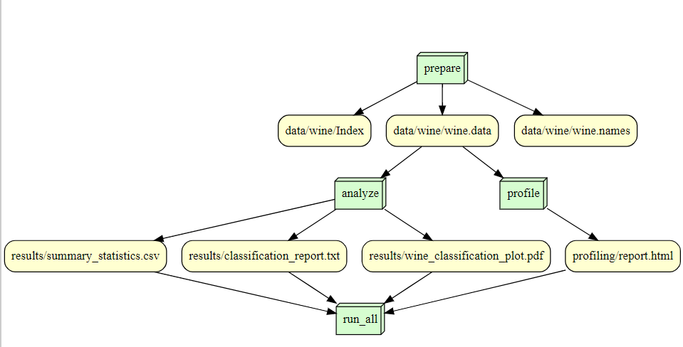

## Overview
In this project, we perform an analysis on the Wine data set from th UCI Machine Learning archive. This dataset uses chemical analysis to differentiate between wines that were made in the same region within Italy. This dataset looks at 13 different chemicals that make up each wine, and how much of each chemical is present in the different wines. In this repository, we performed...

## Contributions
Nora Duffy completed the README, 

Sasha Matveev implemented the licenses for this repository, 

## Analysis

## Workflow

## Reproducing 
docker run --rm -v %cd%:/is477 matveev2/is477-fall2023:final-project snakemake --cores 1 run_all
## License
This repository is under an MIT license.
## References
Aeberhard,Stefan and Forina,M.. (1991). Wine. UCI Machine Learning Repository. https://doi.org/10.24432/C5PC7J.

@misc{misc_wine_109,
  author       = {Aeberhard,Stefan and Forina,M.},
  title        = {{Wine}},
  year         = {1991},
  howpublished = {UCI Machine Learning Repository},
  note         = {{DOI}: https://doi.org/10.24432/C5PC7J}
}